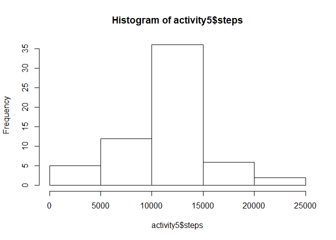

1. Code for reading in the dataset and/or processing the data 


```r
activity <- read.csv(file="C:/Users/cc110/Desktop/Reproducible Research/activity.csv", header=TRUE)
activity$date = as.Date(activity$date)
```

2. Histogram of the total number of steps taken each day


```r
activity1 <- with(activity,aggregate(steps ~ date, FUN = sum))
hist(activity1$steps)
```

<!-- -->

3. Mean and median number of steps taken each day


```r
mean(activity1$steps,na.rm = TRUE)
```

```
## [1] 10766.19
```

```r
median(activity1$steps,na.rm = TRUE)
```

```
## [1] 10765
```

4. Time series plot of the average number of steps taken


```r
activity2 <- with(activity,aggregate(steps ~ interval, FUN = mean))
plot(activity2$interval, activity2$steps, type ='l')
```

<!-- -->

5. The 5-minute interval that, on average, contains the maximum number of steps


```r
activity2[which.max(activity2$steps),]
```

```
##     interval    steps
## 104      835 206.1698
```

6. Code to describe and show a strategy for imputing missing data (Mean for that 5-minute interval)


```r
sum(is.na(activity$steps))
```

```
## [1] 2304
```

```r
lookup <- unique(activity2)
activity3 <- (merge(lookup, activity, by = 'interval'))
activity3$steps <- ifelse(is.na(activity3$steps.y), yes = activity3$steps.x, no = activity3$steps.y)
activity4 <- with(activity3, data.frame(interval, date, steps))
activity5 <- with(activity4, aggregate(steps ~ date, FUN = sum))
```

7. Histogram of the total number of steps taken each day after missing values are imputed


```r
hist(activity5$steps)
```

<!-- -->

```r
mean(activity5$steps)
```

```
## [1] 10766.19
```

```r
median(activity5$steps)
```

```
## [1] 10766.19
```

8. Panel plot comparing the average number of steps taken per 5-minute interval across weekdays and weekends


```r
weekdays <- c('Monday', 'Tuesday', 'Wednesday', 'Thursday', 'Friday')
activity4$day <- factor((weekdays(activity4$date) %in% weekdays), levels=c(FALSE, TRUE), labels=c('weekend', 'weekday')) 
activity6 <- with(activity4, aggregate(steps ~ interval + day, FUN = mean))
library(lattice)
xyplot(activity6$steps~activity6$interval|activity6$day, type = 'l',layout = c(1,2))
```

<!-- -->
